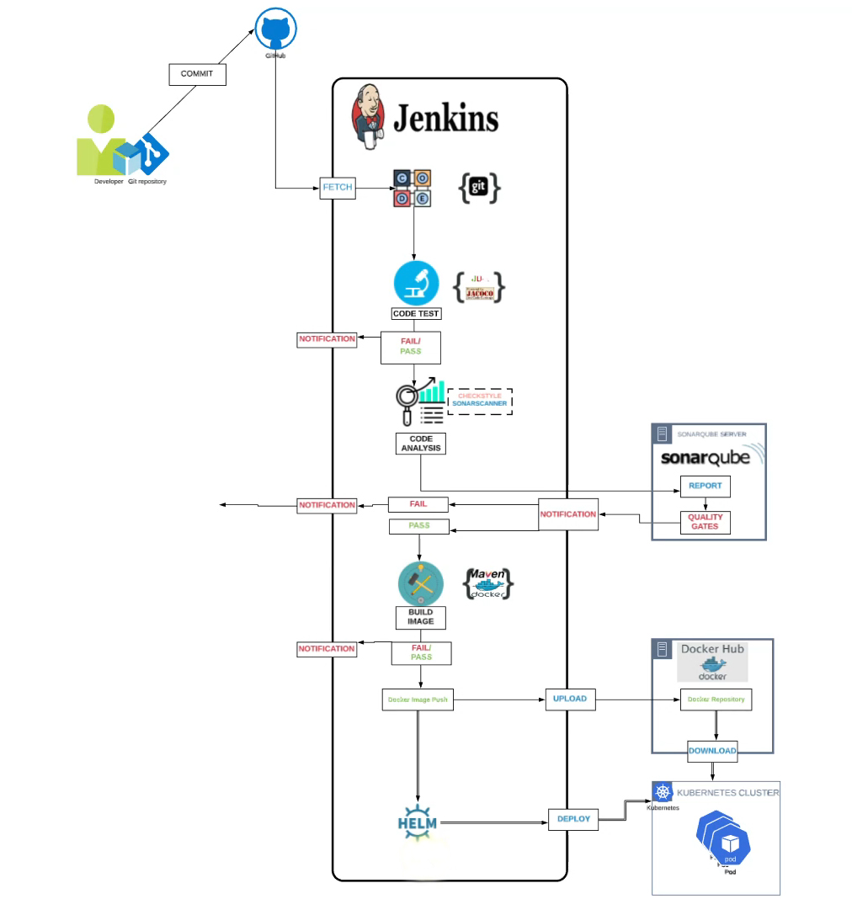

# CICD for Docker Kubernetes Using Jenkins

## Scenario - Current Situation
- Microservices Architecture of an Application
- Containerized Application
- Continuous Code Changes
- Continuous Build & Test
- Regular Build of Container Images
- Regular Deployment Requests to Ops Team.

## Problem - Issues with current situation
- Operation team incharge of Managing containers gets continuous deployment requests.
- Manual Deployment creates dependency.
- Time consuming

## Solution
- Automate build & release process.
- Build Docker Images & Deploy Continuosly as fast as the code commits.
- Continuous Deployment.

## Tools
- Git - Version Control System
- Jenkins - CICD Server
- Docker - Container Runtime
- Docker Hub - Container Registry
- Kubernetes - Orchestration tool
- Helm - Packaging & deploying on Kubernetes
- Sonarqube - Code Analysis Server
- Maven - Build Tool

## Objective
- Continuous Delivery for Containers.

## Architecture - CD Pipeline

## Flow of Execution
1. Continuous Integration Setup
    - Jenkins, Sonarqube & Nexus (Continuous integration project)
2. Dokcerhub account (Containerization Project)
3. Store Dockerhub credentials in Jenkins
4. Setup Docker Engine in Jenkins
5. Install Plugins in Jenkins
    - Docker-pipeline
    - Docker
    - Pipeline utility
6. Create Kubernetes Cluster with Kops
7. Install Helm in Kops VM
8. Create Helm Charts
9. Test Charts in K8s Cluster in test namespace.
10. Add Kops VM as Jenkins Slave
11. Create Pipeline code [Declarative]
12. Update Git Repository with
     - Helm Charts
     - Dockerfile
     - Jenkinsfile (Pipeline code)
13. Create Jenkins job for pipeline
14. Run & Test the job.
